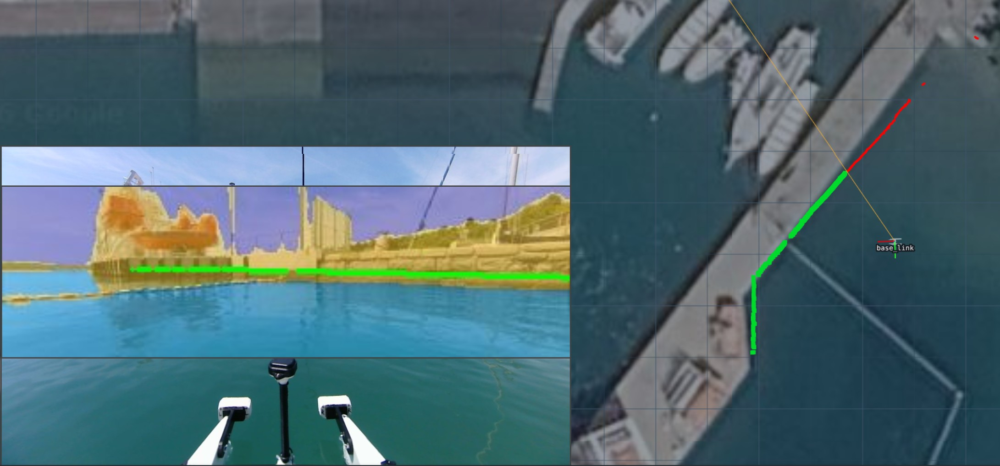

# wasrt_ros

A self-contained ROS One package that runs [WaSR-T](https://github.com/lojzezust/WaSR-T)
(ResNet-101) maritime semantic segmentation on a live camera stream with either PyTorch or TensorRT for the purpose of verifying and filtering unreliable laserscan points.

Tested at 320x96:

| GPU   | PyTorch | TensorRT |
| --------- | ------: | -------: |
| RTX 4060  |  75 fps |  165 fps |
| Orin Nano |   5 fps |   11 fps |

Orin performance isn't great, but it just about matches the required 10 Hz for filtering every lidar message for common lidars. The upside is that it's almost completely reliable at filtering out reflections, direct sunlight, and other marine sources of lidar false detections, so these verified points can be treated with very high confidence.



## Nodes

#### `camera_preprocesor.py`
Downsamples and crops the camera stream to a network-friendly resolution (divisible by 32) and rescales the camera intrinsics to match.

| Parameter | Default | Description |
|---|---|---|
| `~enable_topic` | `/wasrt/enable` | `std_msgs/Bool` power gate for the whole pipeline. Publishing `false` stops the cropped image stream, which halts inference and lidar filtering. The node starts enabled so the model warms up; camera_info keeps publishing regardless. |
| `~camera_topic` | `/camera/image_rect/compressed` | Input image topic. If it ends with `compressed` the node subscribes as `CompressedImage`, otherwise as `Image` (`/camera/image_rect`). The matching `CameraInfo` is read from `<base_topic>/camera_info`. |
| `~output_topic` | `/camera/image_cropped` | Cropped output, published as `Image`. Adjusted intrinsics go to `<output_topic>/camera_info`. |
| `~publish_preview` | `false` | Also publish the cropped image as `CompressedImage` on `<output_topic>/compressed`. |
| `~downsample` | `0.25` | Scale factor applied before cropping. |
| `~crop_top` / `~crop_bottom` | `0.1` / `0.32` | Fraction of the (scaled) image height cut from the top/bottom. |
| `~divisor` | `32` | Output dimensions are trimmed to a multiple of this. |

#### `wasrt_node.py` (PyTorch) and `wasrt_onnx_node.py` (TensorRT)
Both share the same interface:

| Parameter | Default | Description |
|---|---|---|
| `~image_topic` | `/camera/image_cropped` | Input `Image` topic (the preprocessor output). |
| `~seg_topic` | `/wasrt/image_seg` | Raw segmentation result as a `mono8` `Image` with per-pixel class ids (0 obstacle, 1 water, 2 sky). |
| `~preview_topic` | `/wasrt/image_preview/compressed` | Human-visible preview: input image blended with the colored segmentation, as `CompressedImage`. |
| `~publish_preview` | `false` | Enable the preview publisher. |
| `~weights` (torch) / `~engine` (TensorRT) | — | Path to the `.pth` weights / `.engine` file. |

#### `ewasr_node.py` (PyTorch) and `ewasr_onnx_node.py` (TensorRT)
The eWaSR equivalents, with the same four topic parameters above. Extra parameters:

| Parameter | Default | Description |
|---|---|---|
| `~compressed_input` | `false` | Subscribe as `CompressedImage` instead of `Image`. |
| `~resize_input` | `true` | Resize mismatched frames to the model resolution instead of skipping them. |
| `~width` / `~height` (torch only) | `640` / `192` | Model input resolution, both divisible by 32. The TensorRT node reads this from the engine instead. |
| `~precision` (torch only) | `half` | One of `half`, `autocast`, `float`. |

See the [eWaSR](#ewasr) section below for the export and engine build.

#### `lidar_verifyer_node.py`

Cross-checks a 2D lidar scan against the segmentation: each scan point is projected into the camera image and sampled from `/wasrt/image_seg`. Only points that land on an obstacle pixel (class 0) are kept; everything else: points on water/sky, outside the camera's field of view, or behind the camera is set to NaN, since it cannot be verified. Requires the lidar -> camera tf and the preprocessor's `camera_info`.

| Parameter | Default | Description |
|---|---|---|
| `~scan_topic` | `/scan_filtered` | Input `LaserScan`, synchronized with the segmentation. |
| `~scan_out_topic` | `/scan_verified` | Filtered `LaserScan` output. |
| `~seg_topic` | `/wasrt/image_seg` | Segmentation input. |
| `~camera_info_topic` | `/camera/image_cropped/camera_info` | Intrinsics used for projection. |
| `~publish_preview` | `false` | Also sync `/wasrt/image_preview/compressed` and publish it with projected scan points drawn on top (green = verified, red = rejected) to `/wasrt/scan_preview/compressed`. Useful for checking that tf and camera_info are correct. |
| `~static_tf` | `true` | Look up the lidar -> camera transform once and cache it. Set to `false` if the transform can change at runtime. |
| `~obstacle_class` | `0` | Class id treated as a valid obstacle. |


## Installation

Tested on Ubuntu 22.04 + ROS One.

Install ROS dependencies:

```bash
sudo apt install ros-one-cv-bridge ros-one-sensor-msgs python3-opencv
```

Install Python dependencies for the PyTorch node (a CUDA-enabled torch build is required; see https://pytorch.org for the wheel matching your CUDA version):

```bash
pip3 install torch torchvision numpy
```

Download the pretrained WaSR-T weights (trained on MaSTr1478):

```bash
wget -O ~/wasrt_mastr1478.pth https://github.com/lojzezust/WaSR-T/releases/download/weights/wasrt_mastr1478.pth
```

## Building the package

Clone into a catkin workspace and build:

```bash
cd ~/catkin_ws/src
git clone https://github.com/MoffKalast/wasrt_ros.git
cd ..
catkin_make
```

## Running the PyTorch node

```bash
roslaunch wasrt_ros wasr_t.launch weights:=~/wasrt_mastr1478.pth camera_topic:=/camera/image_rect/compressed publish_preview:=true
```

This starts the camera preprocessor and the PyTorch inference node. The segmentation is published on `/wasrt/image_seg` and, with `publish_preview:=true`, an overlay preview on `/wasrt/image_preview/compressed` which you can inspect with `rqt_image_view`.

Note: the model input resolution is fixed by the SIZE constant in `scripts/wasrt_node.py` (default 320x96). The preprocessor's `downsample`/crop parameters in the launch file must produce exactly this resolution for your camera, otherwise frames are skipped with a warning, the current setup assumes a 1280x720 input. Check the actual output size with `rostopic echo -n1 /camera/image_cropped | head` and adjust either side.

## Exporting to ONNX

The temporal context module keeps a rolling feature history, so the ONNX export uses an explicit `mem_in`/`mem_out` state tensor instead of internal state. The export resolution is fixed at trace time: edit the SIZE constant at the top of `misc/export_onnx.py` to match the resolution your preprocessor produces (width, height; both divisible by 32), then:

```bash
pip3 install onnx onnxruntime-gpu onnxconverter-common
python3 misc/export_onnx.py --weights ~/wasrt_mastr1478.pth --out ~/wasrt_320x96.onnx
```

The script exports the model, validates it with `onnx.checker`, and cross-checks the ONNX Runtime output against PyTorch (the reported max logits diff should be small, e.g. < 1e-2 for fp16). Add `--bench 100` to benchmark ONNX Runtime inference.

## Building the TensorRT engine

TensorRT engines are specific to the GPU and TensorRT version, so build the engine on the machine that will run inference:

```bash
pip3 install tensorrt

#tensorrt <10.7
python3 misc/compile_tensorrt_jetpack6.py --in_path ~/wasrt_320x96.onnx --out_path ~/wasrt_320x96_fp16.engine

#tensorrt >10.7
python3 misc/compile_tensorrt_jetpack7.py --in_path ~/wasrt_320x96.onnx --out_path ~/wasrt_320x96_fp16.engine
``` 

This parses the fp16 ONNX file and serializes a TensorRT engine (takes a few minutes while TensorRT autotunes kernels).

## Running the TensorRT node

```bash
roslaunch wasrt_ros wasr_t_onnx.launch engine:=~/wasrt_320x96_fp16.engine camera_topic:=/camera/image_rect/compressed publish_preview:=true
```

Same topics as the PyTorch node: raw class ids on `/wasrt/image_seg`, optional overlay on `/wasrt/image_preview/compressed`. If the engine was built for a different resolution than the incoming images, the node resizes internally, but for correct camera geometry the preprocessor output should match the engine resolution.

## eWaSR

[eWaSR](https://github.com/tersekmatija/eWaSR) is a lighter, single-frame alternative to WaSR-T: no temporal context module, so no rolling feature history and no memory state to carry between frames. It is a drop-in replacement at the topic level, publishing the same class ids on the same topics, so the preprocessor, lidar verifier, and ground projector are unchanged.

Only the non-IMU variants are supported. Both nodes recover the architecture (backbone depth, decoder widths, mixer types, class count) from the checkpoint itself rather than from a `--backbone` string, so a mismatched config fails loudly instead of loading and producing nonsense.

### Running the PyTorch node

```bash
roslaunch wasrt_ros ewasr.launch weights:=~/ewasr_resnet18.pth camera_topic:=/camera/image_rect/compressed publish_preview:=true
```

`scripts/ewasr_node.py` takes `~width`/`~height` (default 640x192, both divisible by 32) and `~precision` (`half`, `autocast`, or `float`). `half` casts the whole graph including BatchNorm and the MetaFormer `layer_scale` parameters, whose 1e-5 init is subnormal in fp16; `autocast` keeps those in fp32 and casts only the convs, which is the safer choice if output looks noisier on-vehicle than it did in validation.

### Exporting to ONNX

eWaSR is stateless, so the export has a single `image` input and single `logits` output, with no `mem_in`/`mem_out` pair. The resolution is fixed at trace time: edit the `SIZE` constant at the top of `misc/export_ewasr_onnx.py`, then:

```bash
pip3 install onnx onnxruntime-gpu onnxconverter-common
python3 misc/export_ewasr_onnx.py --weights ~/ewasr_resnet18.pth --out ~/ewasr_640x192.onnx
```

The script validates with `onnx.checker`, cross-checks ONNX Runtime against PyTorch, and additionally reports the fraction of pixels whose argmax flips, since class ids are what the ROS node actually publishes. Add `--bench 100` to benchmark ONNX Runtime.

Export fp32 and let the TensorRT step handle the cast. `--fp16` exists for parity with `export_onnx.py` but the `layer_scale` parameters noted above make it the worse path here.

Note that the decoder's feature-pyramid upsampling uses `F.interpolate` in the export script where `scripts/ewasr_node.py` uses `torchvision`'s `TF.resize`. `TF.resize` defaults to `antialias=True`, which traces to `aten::_upsample_bilinear2d_aa` and has no ONNX opset 17 equivalent. Those calls only ever upsample, where antialias is a no-op, so the two graphs are numerically identical.

### Building the TensorRT engine

The same version-specific compile scripts are used as for WaSR-T, since they are model-agnostic:

```bash
#tensorrt <10.7
python3 misc/compile_tensorrt_jetpack6.py --in_path ~/ewasr_640x192.onnx --out_path ~/ewasr_640x192_fp16.engine

#tensorrt >10.7
python3 misc/compile_tensorrt_jetpack7.py --in_path ~/ewasr_640x192.onnx --out_path ~/ewasr_640x192_fp16.engine
```

### Running the TensorRT node

```bash
roslaunch wasrt_ros ewasr_onnx.launch engine:=~/ewasr_640x192_fp16.engine camera_topic:=/camera/image_rect/compressed publish_preview:=true
```

`scripts/ewasr_onnx_node.py` reads its input resolution back from the engine's tensor shapes instead of taking `~width`/`~height`, since the resolution is baked in at export time and a launch arg that disagreed with the engine would fail silently. As with the WaSR-T TensorRT node, mismatched incoming frames are resized internally, but the preprocessor output should match the engine resolution for the camera geometry to be correct.

## Pausing inference to save power

The whole pipeline can be paused at runtime without killing any nodes to save power when navigation is idle:

```bash
rostopic pub -1 /wasrt/enable std_msgs/Bool "data: false"   # pause
rostopic pub -1 /wasrt/enable std_msgs/Bool "data: true"    # resume
```

The gate sits in the camera preprocessor, so while disabled no cropped images are produced, both inference nodes idle with the GPU inactive, and the lidar verifier publishes nothing to `/scan_verified`, so costmap updates are stopped as well.

## Acknowledgements

Model architecture and weights from [WaSR-T](https://github.com/lojzezust/WaSR-T) by Lojze Žust and Matej Kristan ("Temporal Context for Robust Maritime Obstacle Detection", IROS 2022).
